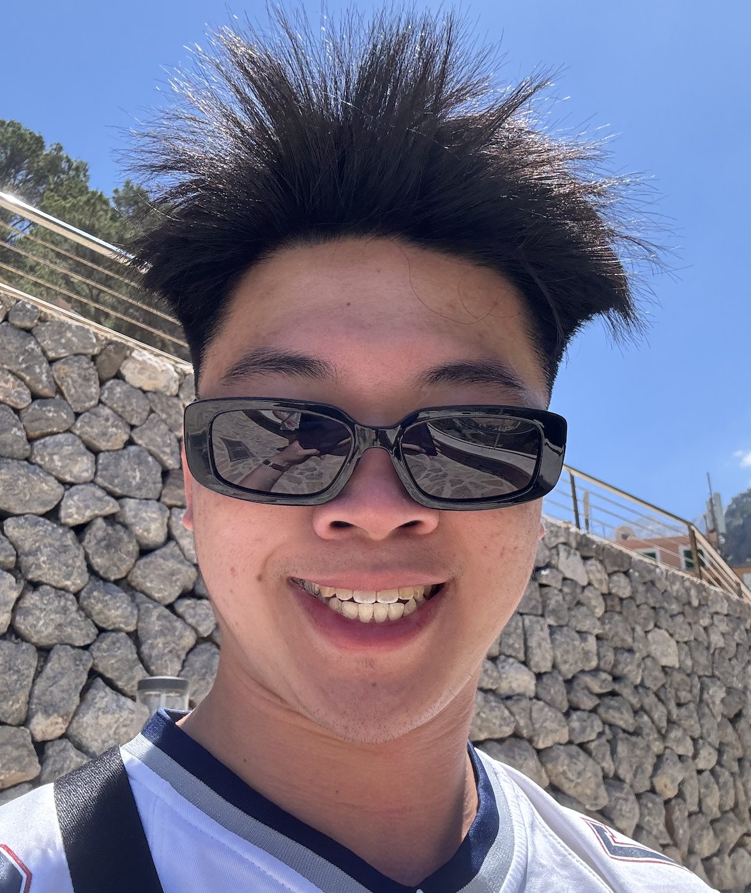
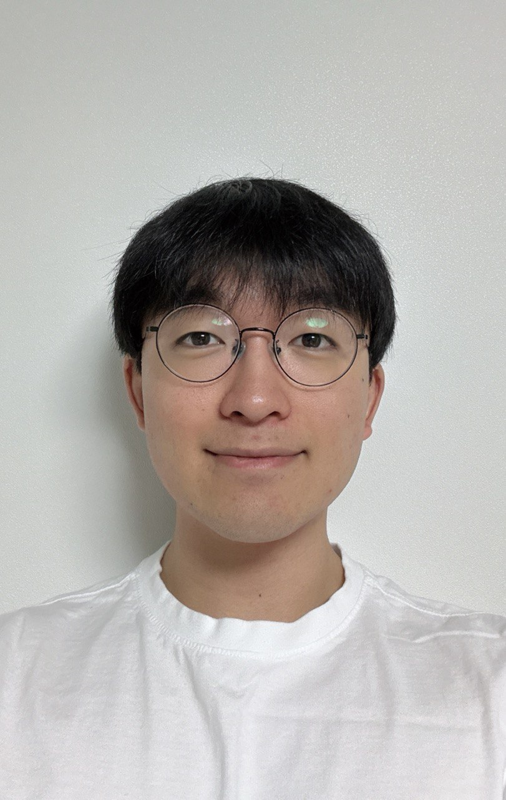

# About Us

We are a team based in the [School of Computing, National University of Singapore](http://www.comp.nus.edu.sg).

You can reach us at the email `seer[at]comp.nus.edu.sg`

## Project team

### Jonathan Ngien

[[github](https://github.com/jonzyyyy)]
* Role: Responsible for filtering guests based on RSVP/Dietary

### Kaung Zin Ye Naung

[[github](http://github.com/kaungzinye)]
[[portfolio](team/kaung.md)]

* Role: Developer
* Responsibilities: Responsible for displaying wedding overview

### Johnny Doe

[[github](http://github.com/johndoe)] [[portfolio](team/johndoe.md)]

* Role: Developer
* Responsibilities: Data

### Jaeho (Jose) Kim

[[GitHub](http://github.com/josejhkim)]
[[LinkedIn](http://linkedin.com/in/josejhkim)]

* Role: Developer
* Responsibilities: Making sure details of wedding guests can be edited properly

### Bhavina

[[github](http://github.com/bhavinaa)]
[[portfolio](www.linkedin.com/in/bhavina-sk)]

* Role: Developer
* Responsibilities: Helping to develop the wedding planner