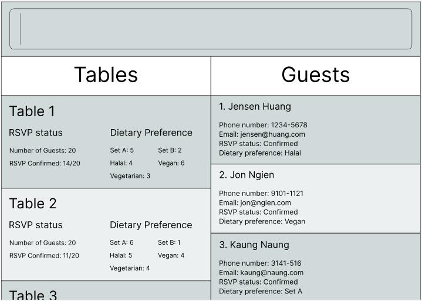
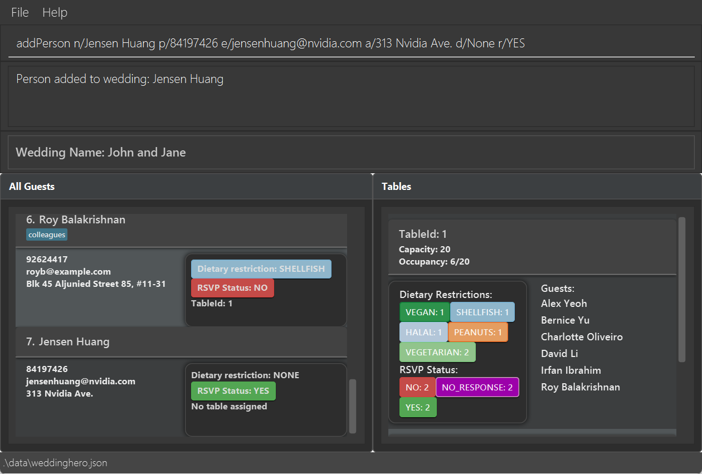
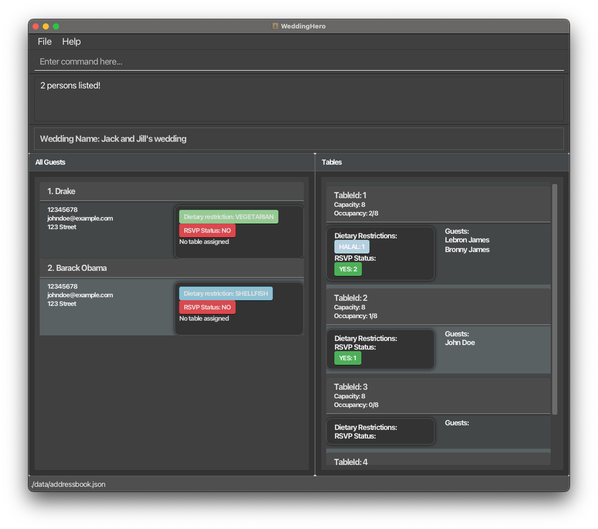
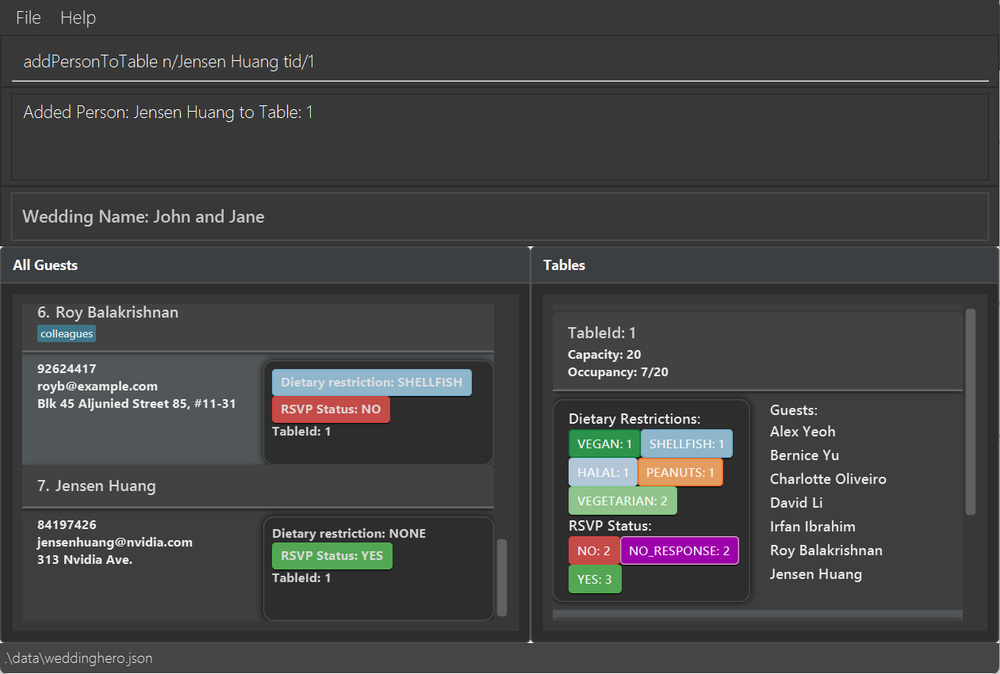

# Wedding Hero User Guide

As a professional wedding planner, you need a tool that keeps pace with your fast-moving schedule.
**Wedding Hero** is a desktop application tailored specifically for you. Optimised for rapid interactions through a
**Command Line Interface (CLI)**—while still offering the clarity and ease of a **Graphical User Interface (GUI)**
—this application is built to help you manage complex wedding details with precision.

### Who Is This For?

Wedding Hero is built for professional wedding planners who need a streamlined tool to manage multiple weddings. This guide assumes you:
- Are familiar with basic desktop applications.
- Prefer fast, keyboard-based workflows while still wanting the option of a GUI.
- Need to maintain detailed guest records, seating plans, and RSVP statuses.
- Wish to save time and reduce manual errors in planning.


### The Challenges We Address

- **Managing wedding details:** Coordinating guest lists, dietary restrictions, and seating can be time-consuming and chaotic when planning multiple weddings.
- **Guest information tracking:** Keeping track of each guest’s contact details, RSVP status, and dietary needs can be challenging.
- **Seating arrangements:** Monitoring seating plans across different weddings requires careful organisation.
- **Avoiding mix-ups:** It is essential to prevent confusion between guests from different weddings.
- **Data navigation:** Sifting through multiple spreadsheets wastes valuable time.

### How Wedding Hero Simplifies Wedding Planning

- **Multi-wedding management:** Easily manage multiple weddings, each with its own set of guests and table arrangements.
- **Smart guest tracking:** Effortlessly keep track of invitations, RSVPs, and any special dietary requirements.
- **Streamlined table assignments:** Quickly assign guests to tables by name rather than by number.
- **Command + GUI interface:** Enjoy the efficiency of command-line input alongside a clear, user-friendly graphical interface.
- **Auto-save and data recovery:** Benefit from automatic saving after every change, ensuring your data is always secure.

---
## Table of Contents

- [Quick start](#quick-start)
- [Using Wedding Hero](#using-wedding-hero)
  - [Getting Help](#getting-help)
  - [Viewing Help: `help`](#viewing-help-help)
- [How Wedding Hero Works (System Flow)](#how-wedding-hero-works-system-flow)
  - [Typical Workflow Example](#typical-workflow-example)
- [Features](#features)
  - [Managing Weddings](#managing-weddings)
    - [Creating a Wedding: `createWedding`](#creating-a-wedding-createwedding)
    - [Setting a Wedding: `setWedding`](#setting-a-wedding-setwedding)
    - [Wedding Overview: `weddingOverview`](#wedding-overview-weddingoverview)
    - [Deleting a Wedding: `deleteWedding`](#deleting-a-wedding-deletewedding)
  - [Managing Guests](#managing-guests)
    - [Adding a Guest: `addPerson`](#adding-a-guest-addperson)
    - [Deleting a Guest: `deletePerson`](#deleting-a-guest-deleteperson)
    - [Editing a Guest: `edit`](#editing-a-guest-edit)
    - [Filtering Guests: `filterPersons`](#filtering-guests-filterpersons)
    - [Finding a Guest: `find`](#finding-a-guest-find)
    - [Listing Guests: `list`](#listing-guests-list)
  - [Managing Tables](#managing-tables)
    - [Adding a Table: `addTable`](#adding-a-table-addtable)
    - [Deleting a Table: `deleteTable`](#deleting-a-table-deletetable)
    - [Listing Tables: `getTables`](#listing-tables-gettables)
    - [Finding a Table: `findTable`](#finding-a-table-findtable)
  - [Assigning a Guest to a Table](#assigning-a-guest-to-a-table)
    - [Adding a Guest to a Table: `addPersonToTable`](#adding-a-guest-to-a-table-addpersontotable)
    - [Removing a Guest from a Table: `deletePersonFromTable`](#removing-a-guest-from-a-table-deletepersonfromtable)
  - [Clearing All Data: `clear`](#clearing-all-data-clear)
  - [Exiting the Program: `exit`](#exiting-the-program-exit)
- [Saving the Data](#saving-the-data)
- [Editing the Data File](#editing-the-data-file)
- [Glossary](#glossary)
  - [List of Prefixes and Their Meanings](#list-of-prefixes-and-its-meaning)
  - [Allowed Dietary Restrictions](#allowed-dietary-restrictions)
  - [Allowed RSVP Values](#allowed-rsvp-values)
  - [Meaning of symbols](#meaning-of-symbols)
- [FAQ](#faq)
- [Known Issues](#known-issues)
- [Command Summary](#command-summary)

---
<div style="page-break-after: always;"></div>

## Quick start

1. Ensure you have Java `17` or above installed in your Computer.<br>
   **Mac users:** Ensure you have the precise JDK version prescribed
   [here](https://se-education.org/guides/tutorials/javaInstallationMac.html).<br>
   **Windows and Linux users:** can find their Java `17` download links
   [here](https://www.oracle.com/java/technologies/downloads/#java17).
2. Download the latest `.jar` file from [here](https://github.com/AY2425S2-CS2103T-F12-3/tp/releases).

3. Copy the file to the folder you want to use as the _home folder_ for your WeddingHero.

4. Open a command terminal, `cd` into the folder you put the jar file in, and use the `java -jar WeddingHero.jar`
   command to run the application.<br>
   A GUI similar to the below should appear in a few seconds. Note how the app contains some sample data.<br>
   


5. Click full screen mode (recommended) for best use of the application. Full screen mode is preferred as it ensures optimal performance; we cannot guarantee error-free operation if the application is not run in full screen mode.

6. Type the command in the command box and press Enter to execute it. e.g. typing **`help`** and pressing Enter will
   open the help window.<br>
- `addPerson n/John Doe p/98765432 e/johnd@example.com a/John street, block 123, #01-01 d/NONE r/YES` : Adds a 
  guest named John Doe with RSVP status and dietary preference to the active wedding.
- `createWedding n/Jack and Jill's Wedding` : Creates a new wedding called "Jack and Jill's Wedding". 
- `exit` : Exits the application.

Refer to the [Features](#features) below for full details of each command.

---

**Notes about the command format:**<br>

- **Words in `UPPER_CASE` are placeholders for user input.**  
  For example, in `add n/NAME`, you can use:  
  `add n/John Doe` (where `John Doe` replaces `NAME`).

- **Prefixes** (e.g., `n/`, `p/`, `e/`) **must be used exactly as shown**, including lowercase letters and the slash.  
  Missing or mistyped prefixes will result in an invalid command.

- **Parameters can be typed in any order.**  For example, `n/John p/91234567` and `p/91234567 n/John` are both valid.

 - **Commands are case-sensitive.** For example, you should type `createWedding` (correct) instead of `createwedding` (incorrect). Camel case means that you start with a lowercase letter and each new word begins with an uppercase letter without any spacing, making it easier for you to read commands.

- **Optional parameters are shown in square brackets.**  
  e.g., `filterPersons [d/DietaryRestriction] [r/RSVP]`.
- **Command Names:** The application uses command names like `addPerson` and `deletePerson` for technical 
  reasons, but these commands are used to manage guests in the wedding. This design choice maintains consistency with the underlying implementation while providing a user-friendly interface for managing wedding guests.

<box>
PDF Warning: If you are using a PDF version of this document, be careful when copying and pasting commands that 
span multiple lines as space characters surrounding line-breaks may be omitted when copied over to the application.
</box>

---
<div style="page-break-after: always;"></div>

## Using Wedding Hero

### Getting Help

You can access a help popup at any time while using Wedding Hero.


### Viewing Help: `help`

Displays a message that explains how to access the full user guide.

**Format:** `help`
## How Wedding Hero Works (System Flow)

Wedding Hero helps you manage **multiple weddings** with ease by using a **“set and operate” model**:

1. **Create a wedding** using the `createWedding` command.
2. **Set the wedding as active** using the `setWedding` command.
3. Once a wedding is set as active, all operations like adding guests, tables, or assigning seats apply **only to that 
   active wedding**.
4. You can view and manage each wedding's guests, tables, and RSVP details independently.

<box type="info" seamless>
You can only interact with one wedding at a time. You must `setWedding` before performing most other commands (e.g., `addPerson`, `addTable`, etc.).
</box>

---


### Typical Workflow Example

Here's a typical command sequence you might use a wedding planner:
```
createWedding n/John & Jane Wedding
setWedding n/John & Jane Wedding
addPerson n/John p/91234567 e/john@example.com a/123 Street d/NONE r/YES
addTable tid/1 c/10
addPersonToTable n/John tid/1
weddingOverview
```
---
<div style="page-break-after: always;"></div>

## Features

## Managing Weddings

---
### Creating a Wedding: `createWedding`

Creates a new wedding in the wedding planner.

**Format:**
`createWedding n/WEDDINGNAME`

- Creates a wedding with the provided `n/WEDDINGNAME`.
- The parameter `n/WEDDINGNAME` should be a valid string representing the name of the wedding. Feel free to use spaces.
- This command is used to quickly add a new wedding event to the system.

**Examples:**
- Running `createWedding n/John & Jane Wedding` will create a wedding entry with the name "John & Jane Wedding".
- Using `createWedding n/Smith Family Wedding` will add a wedding event named "Smith Family Wedding".

<box type="tip" seamless>

- After using createWedding, remember to set the wedding as active using:
  `setWedding n/John & Jane Wedding`
- Always match spacing exactly when setting or referring to a wedding — "John&JaneWedding" is not the same as "John 
& Jane Wedding".
- Once a wedding is set, any added guests, tables, or edits will apply to that active wedding.

</box>

### Setting a Wedding: `setWedding`

Sets a specific wedding as the active wedding, enabling modifications such as adding a guest to a wedding and 
assigning a guest to a wedding's table.

**Format:** `setWedding n/WEDDINGNAME`

- Sets the active wedding context to the wedding with the provided `WEDDINGNAME`.
- Activates a previously created wedding identified by `WEDDINGNAME`.
- Once set, all guest and table operations will apply to this active wedding.
- The `WEDDINGNAME` must match the name used during createWedding, with correct spacing.
- Note: The active wedding setting is not preserved between application sessions. You will need to use `setWedding` again after restarting the application.

<box type="info" seamless>
Design Rationale:

- The `setWedding` command is designed to set the current wedding you are viewing and working on, not to persist the active wedding across application sessions.
- This design choice allows you to:
  - Start fresh with each application session
  - Avoid accidentally modifying the wrong wedding
  - Maintain clear context of which wedding you're working on
  - Explicitly confirm which wedding you want to work with at the start of each session
</box>

<box type="tip" seamless>

- After restarting the application, always set your working wedding using `setWedding` before proceeding with other commands
- Future versions may include a command to list all available weddings
</box>

**Examples:**
- Running `setWedding n/John & Jane Wedding` sets the active wedding to "John & Jane Wedding".
- Using `setWedding n/Smith Wedding` sets the active wedding to the wedding named "Smith Wedding".

<box type="info" seamless> 

You can only modify or view wedding details after setting a wedding as active. Wedding Hero enforces single-wedding context to ensure that all operations are scoped cleanly to one event at a time, avoiding accidental mixing of guest lists across weddings. </box>

### Wedding Overview: `weddingOverview`

Provides an overview of the current active wedding, including details such as the number of tables and total number 
of guests invited.

**Format:** `weddingOverview`

- Retrieves a summary overview of the active wedding.
- No additional arguments are required.
- The overview includes key details such as:
  - Number of tables created
  - Total number of guests invited (regardless of RSVP status)
  - List of all invited guests


<sub>Example output when getting a wedding overview with the command: `weddingOverview`</sub>  
  
<box type="info" seamless>

Future Extension: A future update will add the ability to see the number of guests who have accepted their RSVP, 
helping you better plan for actual attendance.
</box>

**Examples:**
- Running `weddingOverview` after setting an active wedding displays a summary of the wedding, including number of 
  guests invited and number of tables.

### Deleting a Wedding: `deleteWedding`

Deletes a wedding from the system by name.

**Format:** `deleteWedding n/WEDDINGNAME`

- Permanently deletes the wedding identified by `WEDDINGNAME`.
- `WEDDINGNAME` must match the exact name of the wedding you created. The comparison is case-insensitive but spacing 
  must match exactly.
- Once deleted, all associated guests, tables, and data under the wedding will also be removed.

Examples:
- `deleteWedding n/John & Jane Wedding` would delete John & Jane Wedding

<box type="warning" seamless>  

This action is irreversible. Ensure you are deleting the correct wedding before confirming. 
</box>

---

## Managing Guests

### Adding a Guest: `addPerson`

Adds a guest to the current wedding's guest list.

Format: `addPerson n/NAME p/PHONE_NUMBER e/EMAIL a/ADDRESS d/DIETARY_RESTRICTIONS r/RSVP [t/TAG]…​`

- All fields are mandatory, except for `t/TAG`, which is optional.
- A person is identified by their `NAME` only. 
- `t/TAG` only accepts alphanumeric characters, and any amount of tags can be used for each person. <br>
  For example, `addPerson n/John Doe p/12345678 e/johndoe@example.com a/123 Street d/None r/YES t/TAG1 t/TAG2 t/TAG3`
- Multiple guests can have the same contact information such as `PHONE` or `EMAIL` since children may not have a 
  phone number, and it would be more flexible to allow guests to select their point of contact.
- A wedding should be created and set before a person can be added.
- Please refer to the full list of [Allowed Dietary Restrictions](#allowed-dietary-restrictions) and [Allowed RSVP 
  Values](#allowed-rsvp-values).



<sub>Example output when adding a new person named Jensen Huang with the command: `addPerson n/Jensen Huang p/84197426 e/jensenhuang@nvidia.com a/313 Nvidia Ave. d/None r/YES`</sub>

**Examples:**
```
addPerson n/John Doe p/12345678 e/johndoe@example.com a/123 Street d/NONE r/YES t/Child
addPerson n/Alex Tan p/87654321 e/alex@example.com a/456 Avenue d/VEGAN r/NO
```

### Deleting a Guest: `deletePerson`

Deletes a guest from the currently active wedding's guest list, using their displayed index number.

**Format:** `deletePerson INDEX`

INDEX: A positive integer corresponding to the guest's number in the displayed guest list.
(e.g., from a previous list or filterPersons command)

- You must run setWedding before this command — deletion only works for guests in the currently active wedding.
- If the index is invalid or out of range, the system will show an error.
- Deletion is permanent and cannot be undone.

**Examples:**
- Running `deletePerson 1` deletes the first guest shown in the list.
- Running `deletePerson 3` deletes the third guest shown in the list.

<box type="warning" seamless> Make sure you're viewing the correct list of guests before deleting — the index is 
based on the currently displayed list. </box>

### Editing a Guest: `edit`

Edits an existing guest's details in the current wedding.

**Format:** `edit INDEX [n/NAME] [p/PHONE] [e/EMAIL] [a/ADDRESS] [d/DIETARYRESTRICTION] [r/RSVP] [t/TAG]…`

- Edits the guest at the specified `INDEX`. The index refers to the index number shown in the displayed guest list. The index **must be a positive integer** 1, 2, 3, …​
- At least one of the optional fields must be provided.
- Existing values will be updated to the input values.
- When editing tags, the existing tags of the guest will be removed i.e., adding of tags is not cumulative.
- You can remove all the guest's tags by typing `t/` without specifying any tags after it.
- Table ID is the only field that can not be changed as it is changed using the addPersonToTable command.

**Examples:**

- `edit 1 p/91234567 e/johndoe@example.com` This changes the phone number and email address of the first guest in the list.
- `edit 2 n/Betsy Crower d/VEGAN r/NO` This changes the name, dietary restriction and RSVP status of the second guest in the list.


<box type="tip" seamless>

- The index must be a positive integer and must be in the current guest list view.
- At least one field to edit must be provided.
- Fields can be edited in any order.
</box>

### Filtering Guests: `filterPersons`

This command allows you to filter your list of guests by applying `DIETARYRESTRICTION` and/or `RSVP` status filters.
You can use it to display only those guests who meet the criteria you specify.

**Format:** `filterPersons [d/DIETARYRESTRICTION] [r/RSVP]`

- At least one of the two prefixes `d/` and `r/` must be used for this command. Both of the prefixes can be used together as well.
- **Dietary Restriction Filter:** Use the prefix `d/` followed by a valid dietary restriction value (e.g., `VEGAN`, `VEGETARIAN`). 
  Include this if you want to filter guests based on dietary needs. 
  <br>Please see [Allowed Dietary Restrictions](#allowed-dietary-restrictions) for the full list of `DIETARY_RESTRICTIONS` to filter by.
- **RSVP Filter:** Use the prefix `r/` followed by a valid RSVP status (e.g., `YES`).
  Include this if you want to filter guests by their RSVP status. 
  <br> Please see [Allowed RSVP Values](#allowed-rsvp-values) for the full list of `RSVP` status to filter by.
- Note that each prefix can only be used at most once with the command. Running `filterPersons r/NO r/YES` will 
  result in an error.



<sub>Example output when filtering guests based on dietary restrictions, using command: `filterPersons d/VEGETARIAN`</sub>

**Examples:**
- Running `filterPersons d/VEGAN r/YES` displays all guests who are vegan and have accepted the invitation.
- Using `filterPersons d/HALAL` displays all guests with a halal dietary restriction.
- Running `filterPersons r/YES r/NO` will return an error message since multiple categories are not allowed for a prefix.


### Finding a Guest: `find`

Finds and lists all guests whose names contain any of the specified keywords. Keyword matching is case-insensitive.

**Format:** `find KEYWORD [MORE_KEYWORDS]...`

- `KEYWORD [MORE_KEYWORDS]...`: One or more keywords that the command uses to match against a guest's name. A guest is displayed if their name contains any of the keywords.
- Keyword matching is case-insensitive, so a guest with the name `John` will be listed if the keyword used is `john`.

**Examples:**
- `find John`
- `find alice bob`

After running this command, the application updates the guest list view to display only those guests whose names match the specified keywords.

> **Note:** Spaces are used in this command to separate keywords. For example, if there exists a guest with the name `John Tan` and another guest with the name `Jane Doe`. `find John Doe` will list both these guests since `John` is found in `John Tan` and `Doe` is found in `Jane Doe`.

### Listing Guests: `list`

Lists all guests in the current wedding, resetting any applied filters.

**Format:** `list`

- This command displays every guest in the currently selected wedding.
- No prefixes are required for this command. Anything typed after the `list` command will be ignored.
- It updates the current view by removing any filters, ensuring that all guests are shown.

**Example:**
- Running `list` will update the display to show all guests stored in the currently selected wedding.

## Managing Tables
---

### Adding a Table: `addTable`

Adds a table with the specified ID and capacity to the current wedding

**Format:** `addTable tid/TABLEID c/CAPACITY`

- Adds a table with the provided `TABLEID` and `CAPACITY`.
- The parameter `TABLEID` denotes the unique integer identifier for the table. Ensure that it is unique by using
  the `getTablesCommand`, to view the other tables.
- The parameter `CAPACITY` represents the seating capacity of the table.
- Both parameters are required to correctly add the table to the wedding plan.
- The maximum seating capacity is 100 people for each table.

**Examples:**
- Running `addTable tid/12 c/8` will add a table with the ID `12` and a seating capacity for 8 guests.

### Deleting a Table: `deleteTable`

Deletes a table by its ID.

**Format:**
`deleteTable tid/TABLEID`

- Deletes the table with the provided `TABLEID`.
- The parameter `TABLEID` must match the table's ID exactly as stored in the system.
- This command removes the specified table from the currently set wedding.

**Examples:**
- Running `deleteTable tid/12` deletes the table with the ID `12`.

### Listing Tables: `getTables`

Lists all tables currently added to the wedding layout.

**Format:** `getTables`

- Retrieves a list of all tables.
- No additional arguments are required.
- The command displays details of each table like the guests seated at that table for easy reference.

### Finding a Table: `findTable`

Finds a table by its ID.

**Format:** `findTable tid/TABLEID`

- Searches for the table with the specified `TABLEID`.
- The parameter `TABLEID` should exactly match the table's identifier number.
- Useful for quickly locating a specific table in the wedding layout.

**Example:**
- Running `findTable tid/12`  searches and displays the table with the id 12.

## Assigning a Guest to a Table

### Adding a Guest to a Table: `addPersonToTable`
Assigns a guest to a specified table within the currently active wedding.

**Format:** `addPersonToTable n/NAME tid/TABLEID`

- Searches for the table with the specified `TABLEID`.
- The parameter `TABLEID` should exactly match the table's identifier number.
- Useful for quickly locating a specific table in the wedding layout.




<sub>Example output when adding a person named Jensen Huang to table 1 with the command: `addPersonToTable n/Jensen Huang tid/1`</sub>

**Examples:**
- Running `addPersonToTable n/John Doe tid/1`  adds a guest called John Doe to the table with the id 1.


### Removing a Guest from a Table: `deletePersonFromTable`
Removes a Guest from a table in the currently active wedding.

**Format**: `deletePersonFromTable n/NAME tid/TABLEID`  

- `NAME` is the name of the guest displayed on the list
- `TABLEID` is the identifier of the table from which the guest will be removed

**Example:**
- `deletePersonFromTable n/John Doe tid/5` deletes the John Doe guest from the table with ID 5
---

### Clearing All Data: `clear`

Removes **all WeddingHero data** from the system, returning it to an empty state (no weddings, guests, or tables).

**Format:**

- This command **cannot be undone** once executed.
- After running `clear`, WeddingHero **deletes all** data.
- You may back up your data file beforehand if you wish to retain existing records.

**Example:**

<box type="warning" seamless>

**Important:** Executing `clear` permanently removes all data from WeddingHero. Use this command with caution.
</box>

---

## Exiting the program: `exit`

Exits the program.

Format: `exit`

---
## Saving the data

WeddingHero data are saved in the hard disk automatically after any command that changes the data. There is no need to save manually.

---

## Editing the data file

WeddingHero data are saved automatically as a JSON file `[JAR file location]/data/WeddingHero.json`.
Advanced users are welcome to update data directly by editing that data file.

<box type="warning" seamless>

**Important Note about the `clear` Command:**
- The `clear` command completely removes all wedding data from WeddingHero
- This includes all weddings, guests, and tables
- After clearing, you can create new weddings with any name, including names that were previously used
- This action cannot be undone

</box>

<box type="warning" seamless>

**Caution:**

- If your changes to the data file makes its format invalid, WeddingHero will discard all data and start with an
empty data file at the next run. Hence, it is recommended to take a backup of the file before editing it.<br>
- Furthermore, certain edits can cause the WeddingHero to behave in unexpected ways (e.g., if a value entered is outside
the acceptable range). Therefore, edit the data file only if you are confident that you can update it correctly.
</box>

## Glossary
- **Guest**: Refers to an individual invited to attend the wedding. This term is used when discussing the context of the wedding event and the guest's participation in it.

- **Person**: Refers to an individual in the system, typically used when discussing the management of their details such as contact information, dietary restrictions, and RSVP status. This term is more general and can be used outside the context of a specific wedding event.

- **Active Wedding**: The currently selected wedding that all actions (e.g., adding a guest or a table) apply to. You 
  must use the `setWedding` command to set an active wedding.
  
- **Table ID**: A unique integer identifier (e.g., `1`, `5`, `12`) given to each table during the `addTable` command.
  Used for assigning and locating tables.

- **Dietary Restriction**: Describes food requirements or allergies of a guest. Please refer to the full list [here](#allowed-dietary-restrictions).

- **RSVP**: Indicates whether a guest has responded to an invitation. And if so, their response. Please refer to the full list [here](#allowed-rsvp-values).

- **Index**: A positive integer shown in the GUI list view that represents the position of a guest in the current filtered or full list. Used in commands like `deletePerson`.

- **Prefix**: Refers to `n/`, `r/`, `p/` etc. Please refer to the list of prefixes and its meaning below to see what 
  each of them refer to.

<a id="List-of-prefixes"></a>
### List of prefixes and its meaning:
- `n/` → Name of wedding or guest (e.g., John Doe or Jack and Jill's wedding)
- `p/` → Phone number (e.g., 12345678)
- `e/` → Email address (e.g., johndoe@example.com)
- `a/` → Home Address (e.g., 123 Street)
- `d/` → Dietary Restriction of guest (must be selected from [Allowed Dietary Restrictions](#allowed-dietary-restrictions))
- `r/` → RSVP status, information about whether a guest is coming. (Must be selected from [Allowed RSVP Values](#allowed-rsvp-values))
- `t/` → Tag, extra information about a guest. (``Multiple`` tags can belong to one person and only alphanumeric characters are allowed) (e.g.,`t/TAG1 t/TAG2 t/TAG3`)
- `tid/` → Table ID integer used to identify a table within a wedding(Must be greater than 0)
- `c/` → Capacity of a table representing a maximum number of guests that can be allocated to the table.

<a id="allowed-dietary-restrictions"></a>
### Allowed `DIETARYRESTRICTION` values:
- NONE
- VEGETARIAN
- VEGAN
- HALAL
- SHELLFISH
- PEANUTS
- EGGS
- FISH
- SOY
- SESAME

<a id="allowed-rsvp-values"></a>
### Allowed `RSVP` values:
- YES
- NO
- NO_RESPONSE

### Meaning of symbols
| Box Type | Syntax Example                             | Description                                                                                          |
|----------|--------------------------------------------|------------------------------------------------------------------------------------------------------|
| Tip      | <box type="tip" seamless>Tip</box>         | Used to provide helpful hints and suggestions to enhance your workflow.                            |
| Info     | <box type="info" seamless>Info</box>       | Provides additional context or clarification about a feature or instruction.                       |
| Warning  | <box type="warning" seamless>Warning</box> | Alerts the reader to important cautions or irreversible actions that need careful consideration.    |


---

## FAQ

**Q**: How do I transfer my data to another Computer?<br>
**A**: Install the app in the other computer and overwrite the empty data file it creates with the file that contains
the data of your previous WeddingHero home folder.

**Q**: Where can I find updates or release notes about Wedding Hero?<br>
**A**: Updates, release notes, and additional documentation can be found on our GitHub repository [here](https://github.com/AY2425S2-CS2103T-F12-3/tp). We regularly update the application with new features, bug fixes, and enhancements to improve your planning experience.

**Q**: Why do my commands sometimes result in errors?  
**A**: This might be due to an incorrect command format or missing/incorrect prefixes. Make sure you follow the exact syntax specified in the User Guide, including using the proper camel-case format (e.g., `createWedding` instead of `createwedding`).

**Q**: I created a wedding, but why can't I add to it?  
**A**: Remember to set the wedding you just added as active with the `setWedding` command. This ensures that all guest and table operations are applied to the selected wedding.

**Q**: How is my data saved in Wedding Hero, and what precautions should I take when editing it manually?  
**A**: Wedding Hero automatically saves your data in a JSON file located in the application's data folder. If you choose to edit this file manually, be sure to maintain the correct JSON format to prevent data corruption. It’s recommended that you back up your data before making any manual changes.

---
## Planned Enhancements
1. We understand that the list of dietary restrictions is not exhaustive and does not include all dietary 
   restrictions people may have, but the list we have provided is applicable to majority of the population. We will try our best to include more dietary restrictions in the future. Stay tuned!

2. Currently, we do not expect most professional wedding planners to manage so many weddings at once that they cannot recall each event’s name. However, as our user base grows and the application’s usage scales, we plan to introduce a feature that displays all created weddings. This will provide planners an easy way to reference multiple weddings at a glance, ensuring a smoother workflow in high-volume scenarios.

---
## Known issues
1. When using multiple screens, if you move the application to a secondary screen, and later switch to using only the primary screen, the GUI will open off-screen. The remedy is to delete the preferences.json file created by the application before running the application again.

2. If you minimize the Help Window and then run the help command (or use the Help menu, or the keyboard shortcut F1) again, the original Help Window will remain minimized, and no new Help Window will appear. The remedy is to manually restore the minimized Help Window.


---
## Command Summary

| **Action**                | **Format, Examples**                                                                                                                                                                            |
|---------------------------|-------------------------------------------------------------------------------------------------------------------------------------------------------------------------------------------------|
| **help**                  | `help`  
| **createWedding**         | `createWedding n/NAME`<br>Example: `createWedding n/John & Jane Wedding`                                                                                                                        |
| **deleteWedding**         | `deleteWedding n/NAME`<br>Example: `deleteWedding n/John & Jane Wedding`                                                                                                                        |
| **setWedding**            | `setWedding n/NAME`<br>Example: `setWedding n/Smith Wedding`                                                                                                                                    |
| **weddingOverview**       | `weddingOverview`                                                                                                                                                                               |
| **addPerson**             | `addPerson n/NAME p/PHONE e/EMAIL a/ADDRESS d/DIETARYRESTRICTION r/RSVP [t/TAG]…`<br/>Example: `addPerson n/John Doe p/12345678 e/johndoe@example.com a/123 Street d/Vegan r/YES t/TAG1 t/TAG2` |
| **deletePerson**          | `deletePerson INDEX`<br>Example: `deletePerson 3`                                                                                                                                               |
| **edit**                  | `edit INDEX [n/NAME] [p/PHONE] [e/EMAIL] [a/ADDRESS] [d/DIETARYRESTRICTION] [r/RSVP] [t/TAG]…`<br>Example: `edit 1 p/91234567 e/johndoe@example.com`                                            |
| **filterPersons**         | `filterPersons [d/DIETARYRESTRICTION] [r/RSVP_FIELD]`<br>Example: `filterPersons d/Vegan r/YES`                                                                                                 |
| **find**                  | `find KEYWORD [MORE_KEYWORDS]...`<br>Example: `find John`                                                                                                                                       |
| **addTable**              | `addTable tid/TABLE_ID c/CAPACITY`<br>Example: `addTable tid/1 c/8`                                                                                                                             |
| **addPersonToTable**      | `addPersonToTable n/NAME tid/TABLE_ID`<br>Example: `addPersonToTable n/John Doe tid/1`                                                                                                          |
| **deletePersonFromTable** | `deletePersonFromTable n/NAME tid/TABLE_ID`<br>Example: `deletePersonFromTable n/John Doe tid/1`                                                                                                |
| **deleteTable**           | `deleteTable tid/TABLE_ID`<br>Example: `deleteTable tid/1`                                                                                                                                      |
| **findTable**             | `findTable tid/TABLE_ID`<br>Example: `findTable tid/1`                                                                                                                                          |
| **getTables**             | `getTables`                                                                                                                                                                                     |
| **clear**                 | `clear`                                                                                                                                                                                         |
| **exit**                  | `exit`                                                                                                                                                                                          |
